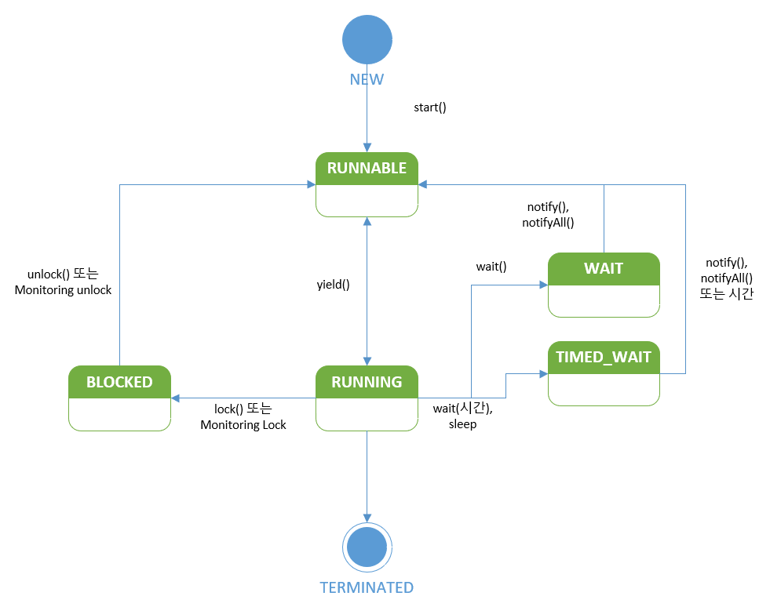
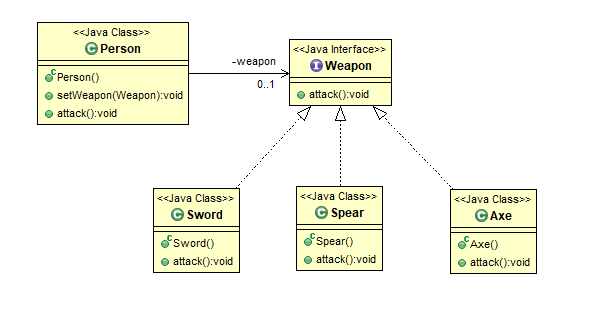

# 0. 환경
- Windows 10
- Intellij
- Amazon Corretto JDK 11

# 1. async : 자바 비동기 연습 
## Basic
### 공유 자원의 동기화를 연습
- synchronize method
  - non-static, static
- synchronize block
- Mutex, Semaphore
### 설명
- 2명의 유저가 서로 채팅을 10000번 번갈아 치는 것을 가정
- 전체 채팅의 수는 공유 자원
  - 전체 채팅의 수가 20000번이 되는지 확인
  - 스레드 차원의 일괄처리 or 타임 슬라이스 확인
- 동기화 테스트를 위해 User.java 에 14가지 케이스 설정
  - run() 메소드의 button 변수의 값을 설정하면 테스트 가능
- 각 케이스별 주석 작성
  - _"결과 + 추론 + 결론"_  

## Control

### 1. wait hands on
- SharedData 객체에 대해 각각 3개의 멀티 스레드를 활용한 쓰기 및 읽기
- 데이터의 읽기/쓰기 가능 여부를 저장
  - 스레드가 실행가능할 때까지 busy waiting(while 무한 루프)
- 접근 가능 여부를 확인 후 wait 과 notify 활용
  - wait 은 실행중인 스레드를 일시정지 상태로 만든다
    - timeout 설정 또는 notify 에 의해 실행대기 상태 복귀
  - notifyAll() 은 일시정지 상태의 모든 스레드를 실행대기 상태 복귀
    - 모니터(락)을 얻지 못하였기에 꺠어났다고해서 스레드가 바로 실행되는 것이 아님
- 참조: https://www.youtube.com/watch?v=cNPMYBlg974
### 2. Pub/Sub Model Mocking

## Performance
### 스레드 성능 최적화 연습

# 2. design : OOP 연습
## 1. Basic Principles
### 1. DRY
- Don't Repeat Yourself
  - 코드의 반복 X -> 유지 보수 효율성 높이기 위함
  - 반복되는 코드는 함수로 추상화 시켜주기
### 2. KISS
- Keep It Simple and Stupid
  - 코드를 간결하고 이해하기 쉽게 작성 -> 유지 보수와 협업에 용이
  - 메소드가 하는 일을 경량화
- Simple Code 란, 
  - Readable
  - Maintainable
  - Self-descriptive 
### 3. YAGNI 
- You Aren't Gonna Need It
- 필요에 의한 개발만하는 원칙 -> 유지 보수에 대한 부채 없애기 위함
  - No Code for explanation
### 4. SLAP
- Single Level of Abstraction Principle
- 메소드가 구현부의 추상화 정도를 간결하게 유지하기 위한 원칙
  - 메소드가 하는 일은 한 가지 의도만을 담고 있어야 한다.
    - Ex. Validation 을 하려면 Validation 만 Query 를 하려면 Query 만 처리
  - 메소드는 One reason to change 하게 된다
- Easy to Read, Reuse, Test
- 간단한 ETL 예제
  - Extract, Transform, Load 부분을 나눠서 작성
### 5. Delegation
- 다른 클래스나 메소드로 작업의 책임을 넘기는 것(위임) -> De-Coupling 
  - 위임받은 객체나 메소드를 활용한 작업은 이전보다 결합도를 낮출 수 있음 
- Extend functionality without extend
## 2. SOLID
### 1. SRP (Single Responsibility Principle)
- **클래스는 하나의 책임만을 가진다**
  - Only one reason to change
  - 클래스는 오직 하나의 의도만을 가지게 함을 의미
    - 각 class 와 behavior 관계가 명확해진다
### 2. OCP (Open Closed Principle)
- **Software Entities(클래스, 모듈, 메소드 등) 들은 확장이 변경없이 가능함**
  - Open for extension & Close for modification
  - 다른 객체나 메소드가 의존하는 형태로 확장되는 구조인 경우 **추상화**와 **다형성** 활용
    - 기존 Entity 는 의존하고 있는 객체를 신경쓰지 않아도 된다.(변경 X) 
  - You should be able to extend a classes behavior, without modifying it.
### 3. LSP (Liskov Substitution Principle)
- 리스코프 치환 원칙(부모<=>자식)
- **자식 클래스는 부모 클래스가 가진 역할을 온전히 수행할 수 있어야 함**을 의미
  - 같은 행위에 대한 결과가 상이하면 안됨 -> 아래 3 중 1 개로 해결
    - 부모 클래스 메소드 삭제 후 자식마다 메소드 새롭게 정의
    - 사용할 메소드를 구분 지어줄 중간 단계의 클래스 새롭게 정의
    - Inheritance -> Association 으로 관계 재설정
### 4. ISP (Interface Segregation Principle)
- 인터페이스 분리 원칙
- **인터페이스를 구현하는 클래스는 자신이 사용하지 않는 메소드에 의존하지 않아야 함**
  - 인터페이스를 구체적이고 작은 단위로 분리시키기
  - 구현 클래스들은 꼭 필요한 메소드만을 이용하게 만들기 
    - 인터페이스의 다중 상속 활용
### 5. DIP (Dependency Inversion Principle)
   
- 의존성 역전 원칙
- **고수준 모듈은 저수준 모듈의 구현에 의존해서는 안된다**
  - 자신보다 변하기 쉬운 객체에 직접 의존하면 안됨을 의미
  - 추상화를 활용해 객체간 의존도 낮추며 확장성 가지기
- **두 모듈 사이에 Abstraction 을 활용하여 의존도 낮추기**
  - 고수준 모듈에서 이 Abstraction 을 사용함(Higher Module depends on Abstract)
  - 저수준 모듈은 이 Abstraction 을 구현(Lower implements Abstract)
- Higher Level Modules <=> Abstract Layer(Interface,Abstract Class) 
  - Abstract Layer(Interface,Abstract Class) <=> Lower Level Modules